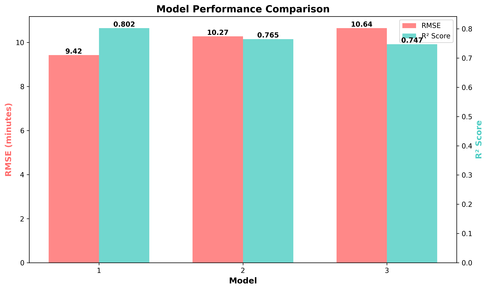
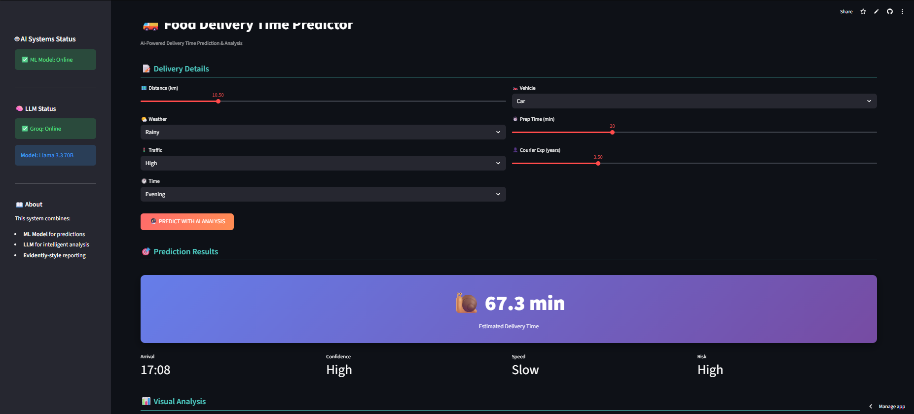
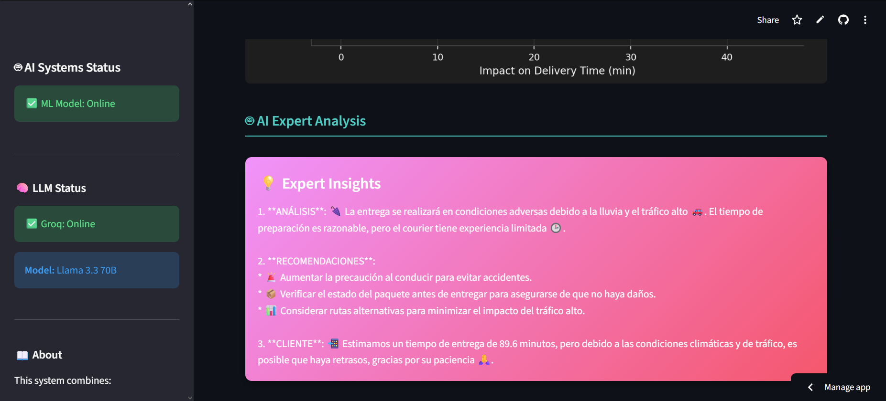

<div align="center">

# Food Delivery Time Prediction System

</div>

<div align="center">


Sistema de predicción de tiempos de entrega con 80% de precisión usando Random Forest e integración con LLM.

[Demo en Vivo](https://food-delivery-time-prediction-z3c8fxrjyqn3nbwe784grg.streamlit.app) • [Documentación](https://github.com/jmeza-data/food-delivery-time-prediction)

</div>


## Descripción General


Este proyecto aborda un desafío crítico en la logística urbana: predecir con precisión los tiempos de entrega de pedidos de comida. La solución combina análisis SQL operacional con machine learning y despliegue en producción.
El componente de SQL identifica patrones de negocio, rutas problemáticas y factores operacionales mediante queries sobre un modelo relacional de 4 tablas. El modelo de ML (Random Forest con R²=0.802) predice tiempos en tiempo real, mientras que la integración con LLM proporciona recomendaciones contextualizadas. Además de estimar tiempos de entrega, la solución permite identificar las variables que más influyen en los retrasos y aporta insights relevantes tanto para la operación logística del negocio como para la experiencia del cliente.
 contextualizadas para operaciones y comunicación con clientes.

---

## Componentes del Sistema

**Machine Learning**
- Modelo Random Forest con R²=0.802
- 32 features derivadas de 7 variables base
- Error promedio menor a 10 minutos
- Pipeline completo de preprocesamiento y entrenamiento

**API REST**
- FastAPI con documentación Swagger
- Validación de datos con Pydantic
- Endpoints para predicción y monitoreo

**Dashboard Interactivo**
- Predicciones en tiempo real
- Visualizaciones de distribución y factores de impacto
- Métricas de desempeño del modelo
- Análisis potenciado por LLM

**Análisis SQL**
- 13 queries (5 requeridas + 8 análisis adicionales)
- Identificación de patrones temporales y rutas problemáticas
- Insights operacionales documentados

---

## Resultados

| Métrica | Valor |
|---------|-------|
| R² Score | 0.802 |
| RMSE | 9.42 minutos |
| MAE | 6.57 minutos |
| MAPE | 12.6% |
| Tiempo respuesta API | <100ms |

**Decisión técnica destacada:** Creé la variable `Estimated_Base_Time = (Distance × 2) + Prep_Time` que se convirtió en el predictor más importante del modelo (importance = 0.232). Esto demuestra que el conocimiento de dominio puede superar features más complejas.

---

## Comparación de Modelos



Probé tres algoritmos y Random Forest superó a los demás:

- RMSE: 9.42 min vs 10.27 (LightGBM) vs 10.64 (XGBoost)
- R² Score: 0.802 vs 0.765 (LightGBM) vs 0.747 (XGBoost)
- Tiempo de entrenamiento: 4.7 segundos

Random Forest mostró mejor balance entre precisión, estabilidad y capacidad para capturar relaciones no lineales.

---

## Stack Tecnológico

<p align="center">
  
</p>

- ML: scikit-learn, XGBoost, LightGBM
- API: FastAPI, Uvicorn, Pydantic
- Frontend: Streamlit, Matplotlib, Seaborn
- LLM: Groq (Llama 3.3 70B)
- Base de Datos: SQL Server
- Herramientas: Pandas, NumPy, Joblib

---

## Demo

### Dashboard Streamlit

Pruébalo aquí: [food-delivery-time-prediction-z3c8fxrjyqn3nbwe784grg.streamlit.app](https://food-delivery-time-prediction-z3c8fxrjyqn3nbwe784grg.streamlit.app)

*Nota: Puede tardar 1 minutito en cargar inicialmente, revisalo quedo muy chevre*



Funcionalidades:
- Sliders interactivos para configurar parámetros de entrega
- Predicción en tiempo real con nivel de confianza
- Gráficos de distribución histórica y factores de impacto
- Análisis contextual generado por LLM

---

### Análisis Visual


El dashboard muestra:
- Análisis de Distribución: comparación de la predicción vs datos históricos
- Gauge de Tiempo: representación visual de la velocidad estimada
- Factores de Impacto: variables que más afectan el tiempo de entrega

---

### Insights con LLM



El LLM (Llama 3.3 70B de Groq) genera:
- Análisis contextual de cada predicción
- Recomendaciones operacionales
- Sugerencias de comunicación al cliente

Decidí usar Groq porque tiene tokens gratuitos y agrega valor sin costo adicional al sistema.

---

### API REST


Documentación interactiva disponible en `/docs`

**Ejemplo de uso:**


```bash
curl -X POST "http://localhost:8000/predict" \
  -H "Content-Type: application/json" \
  -d '{
    "Distance_km": 10.5,
    "Weather": "Rainy",
    "Traffic_Level": "High",
    "Time_of_Day": "Evening",
    "Vehicle_Type": "Car",
    "Preparation_Time_min": 20,
    "Courier_Experience_yrs": 3.5
  }'
```

Respuesta:
```json
{
  "predicted_delivery_time_minutes": 67.3,
  "confidence_level": "high",
  "model_version": "v1.0"
}
```

---

## Análisis SQL

### Modelo Relacional


El diseño captura la operación completa con 4 tablas:

- DELIVERY_PERSONS: información de repartidores
- RESTAURANTS: catálogo de restaurantes
- DELIVERIES: registro de entregas
- ORDERS: órdenes individuales

Relaciones: Un repartidor realiza muchas entregas (1:N), un restaurante prepara muchas órdenes (1:N), una entrega contiene muchas órdenes (1:N).

### Queries y Análisis

Carpeta `SQL/` contiene:

**5 Queries Principales:**
1. Top 5 áreas con mayor tiempo de entrega (últimos 30 días)
2. Tiempo promedio por tráfico, área y tipo de cocina
3. Top 10 couriers más rápidos (mínimo 50 entregas activas)
4. Área de restaurante más rentable (últimos 3 meses)
5. Couriers con tendencia creciente en tiempos

**8 Análisis Adicionales:**
- Patrones temporales de demanda
- Impacto del clima en eficiencia
- Rutas problemáticas
- Experiencia vs desempeño
- Factores de satisfacción del cliente
- Rentabilidad por tipo de cocina
- Detección de anomalías
- Optimización de flota

Ver detalles en: [`SQL/sql_insights.md`](SQL/sql_insights.md)

### Hallazgos SQL

Los análisis revelaron patrones claros: horas pico de 12-14h y 19-21h son altamente predecibles. Clima adverso incrementa tiempos en 15-20%. Couriers con más de 2 años de experiencia son 15% más rápidos. El rating cae drásticamente cuando el tiempo supera 60 minutos.

Identifiqué rutas específicas consistentemente lentas y tipos de cocina con mejor rentabilidad por minuto. El ratio óptimo es 3-4 entregas por courier por hora.

---

## Decisiones Técnicas

**Feature Engineering**

Diseñé `Estimated_Base_Time = (Distance × 2) + Prep_Time` que se convirtió en la feature más importante. Esto demuestra que el conocimiento de dominio simple puede superar features más complejas.

**Arquitectura API + Dashboard**

Implementé dos interfaces: API para integración con sistemas existentes (apps móviles, herramientas internas) y dashboard para equipo de operaciones y demos. Esto cubre necesidades técnicas y de negocio.

**Integración LLM**

Las predicciones numéricas necesitan contexto para tomar decisiones. El LLM genera recomendaciones accionables y mejora la comunicación con clientes.

**Desafíos**

- Subestimación en días lluviosos: propuse features de interacción y mejoras en granularidad de datos
- Transferibilidad entre ciudades: diseñé enfoque de 3 fases con transfer learning
- Preparación para producción: documenté arquitectura completa de deployment

Ver análisis completo en: [`reports/strategic_reflections.md`](reports/strategic_reflections.md)

---

## Instalación y Uso

**Prerequisitos:** Python 3.10+

**Clonar repositorio:**
```bash
git clone https://github.com/jmeza-data/food-delivery-time-prediction.git
cd food-delivery-time-prediction
```

**Instalar dependencias:**
```bash
pip install -r requirements.txt
```

**Entrenar modelos:**
```bash
python model_pipeline/run_pipeline.py
```

Este comando carga datos, crea 32 features, entrena 3 modelos, guarda el mejor y genera reporte de comparación.

**Ejecutar API:**
```bash
cd api
python main.py
```

Disponible en:
- Swagger UI: http://localhost:8000/docs
- Health check: http://localhost:8000/health

**Ejecutar Dashboard:**
```bash
streamlit run streamlit_app.py
```

Se abrirá en: http://localhost:8501

---

## Estructura del Proyecto
```
food-delivery-time-prediction/
│
├── SQL/
│   ├── sql_queries.sql
│   └── sql_insights.md
│
├── model_pipeline/
│   ├── config.py
│   ├── data_loader.py
│   ├── preprocessor.py
│   ├── feature_engineer.py
│   ├── model_trainer.py
│   ├── predictor.py
│   └── run_pipeline.py
│
├── api/
│   ├── main.py
│   └── README.md
│
├── models/
│   ├── delivery_time_model_v1.0.pkl
│   ├── preprocessor_v1.0.pkl
│   └── feature_engineer_v1.0.pkl
│
├── data/
│   └── Food_Delivery_Times.csv
│
├── reports/
│   ├── model_comparison_*.csv
│   └── strategic_reflections.md
│
├── images/
├── notebooks/
├── streamlit_app.py
├── requirements.txt
└── README.md
```

---

## Endpoints de la API

| Método | Endpoint | Descripción |
|--------|----------|-------------|
| GET | `/` | Información de la API |
| GET | `/health` | Estado del modelo |
| POST | `/predict` | Predicción de tiempo |
| GET | `/model-info` | Metadata y métricas |
| GET | `/examples` | Ejemplos de requests |

**Ejemplo en Python:**
```python
import requests

order = {
    "Distance_km": 10.5,
    "Weather": "Rainy",
    "Traffic_Level": "High",
    "Time_of_Day": "Evening",
    "Vehicle_Type": "Car",
    "Preparation_Time_min": 20,
    "Courier_Experience_yrs": 3.5
}

response = requests.post("http://localhost:8000/predict", json=order)
result = response.json()
print(f"Tiempo estimado: {result['predicted_delivery_time_minutes']:.1f} min")
```

**Valores válidos:**

Categóricos:
- Weather: Clear, Cloudy, Rainy, Snowy, Foggy, Windy
- Traffic_Level: Low, Medium, High
- Time_of_Day: Morning, Afternoon, Evening, Night
- Vehicle_Type: Bike, Scooter, Car

Numéricos:
- Distance_km: 0.1 - 50.0
- Preparation_Time_min: 5 - 60
- Courier_Experience_yrs: 0.0 - 15.0

---

## Autor

**Jhoan Sebastian Meza Garcia**  
Estudiante de Economía ! Universidad Nacional de Colombia

[LinkedIn](https://www.linkedin.com/in/jhoan-sebastian-meza-garcia-12228b329/) • [GitHub](https://github.com/jmeza-data)

**Gracias por llegar hasta aqui, tengo muchos proyectos chevres si quires revisar**
- [Regresión IPM Continuo a Nivel de Hogar](https://github.com/jmeza-data) - XGBoost para predicción de IPM
- [Análisis SHAP para Interpretabilidad](https://github.com/jmeza-data) - Explicabilidad en modelos ML
- [Más repositorios...](https://github.com/jmeza-data?tab=repositories)

---

<div align="center">

Desarrollado por [Jhoan Meza](https://github.com/jmeza-data)

</div>
